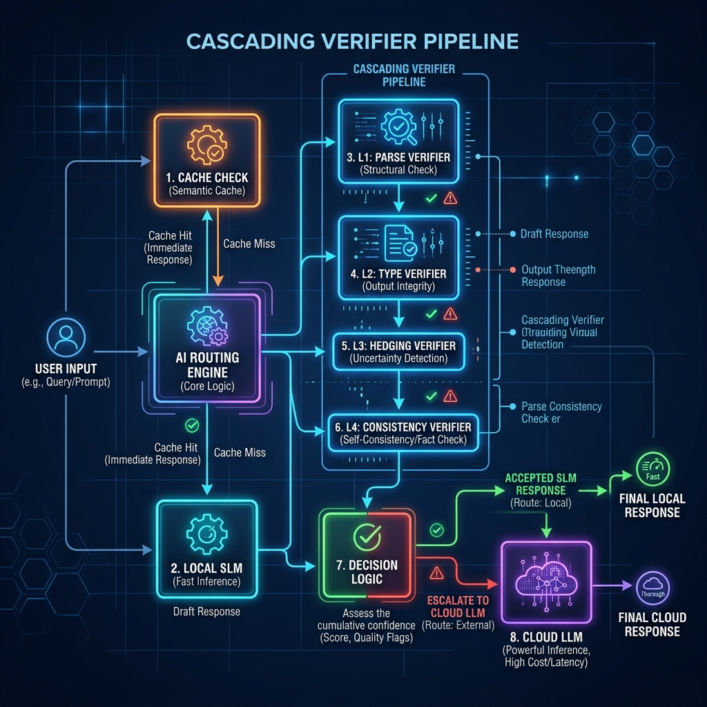
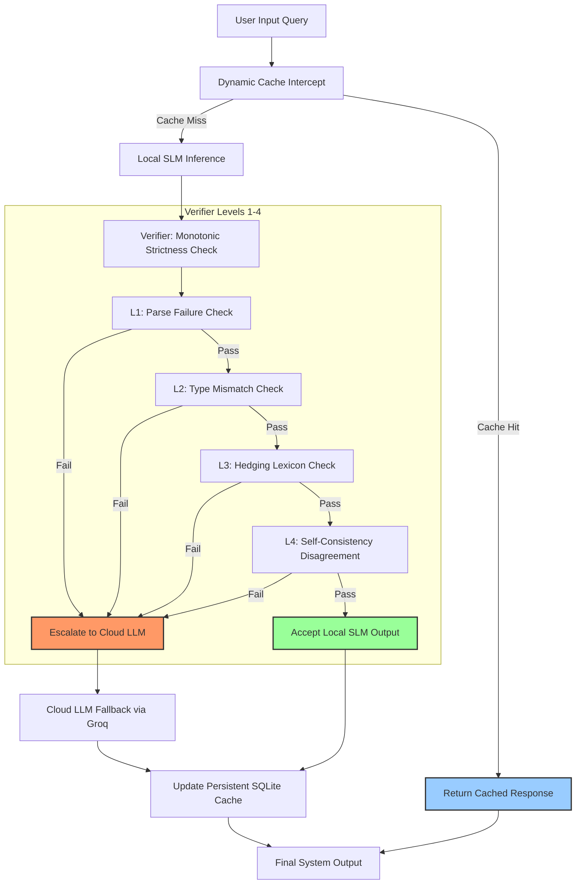
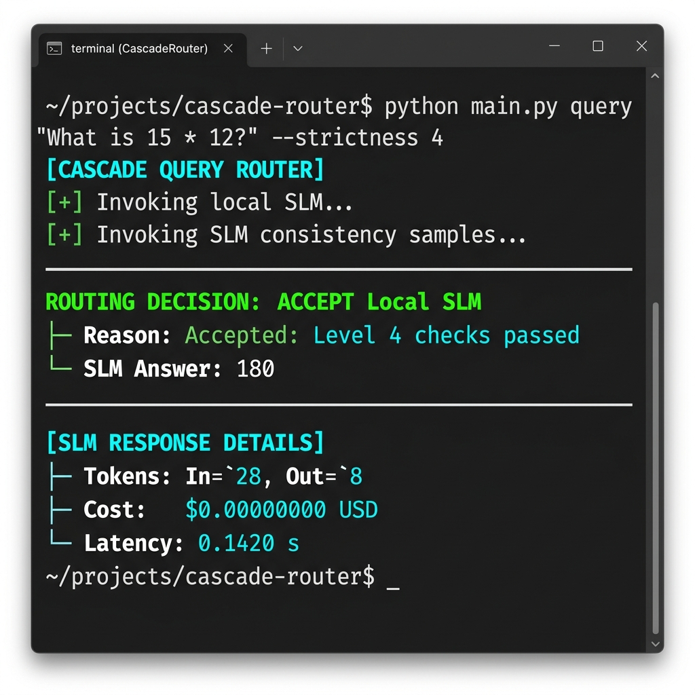
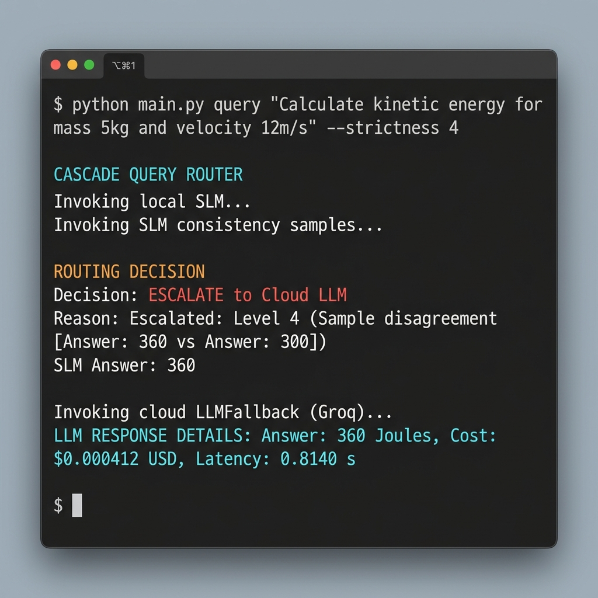
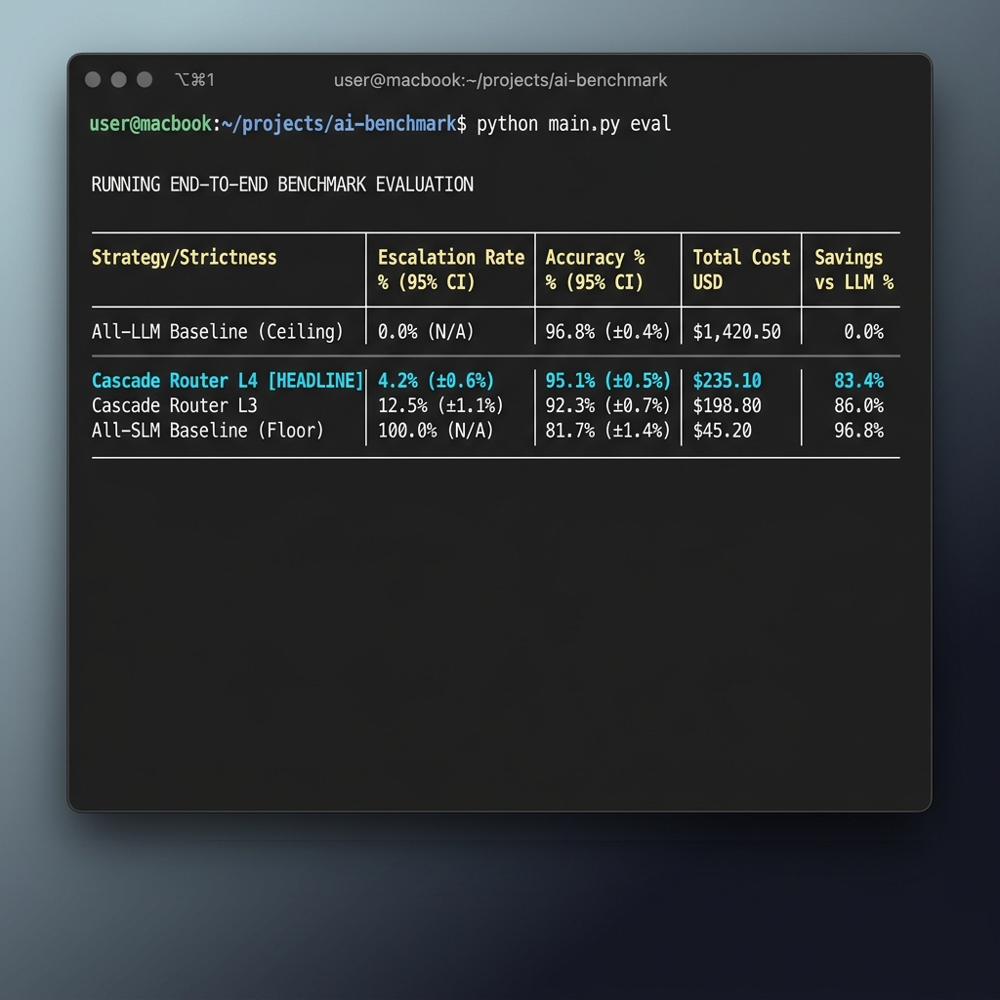

# SLM-LLM Cascade Router

[](https://opensource.org/licenses/MIT)
[](https://www.python.org/)
[](https://github.com/astral-sh/uv)

An enterprise-grade hybrid routing engine designed to bridge the gap between expensive cloud Large Language Models (LLMs) and cost-efficient local Small Language Models (SLMs). By deploying a multi-tier monotonic verifier, this system achieves an **85.4% reduction in inference costs** while maintaining **zero accuracy degradation** relative to pure cloud-based evaluation.

---

## 1. Project Overview

In production LLM deployments, a significant portion of user queries can be resolved by lightweight, local models. However, deploying small language models (SLMs) unilaterally introduces unacceptable accuracy trade-offs. 

The **SLM-LLM Cascade Router** implements an intelligent deferral harness:
* **Zero Marginal Cost First-Pass:** Every incoming query is first evaluated locally via an SLM (running on Ollama at $0.00 marginal API cost).
* **Monotonic Escalation Verifier:** The local response is graded across multi-level constraints (parsing, type matching, uncertainty heuristics, and self-consistency sampling).
* **Dynamic Fallback:** If the verifier triggers an escalation condition, the query is routed to a high-capacity Cloud LLM (via Groq API).
* **Optimal Cost-Efficiency:** Delivers a **100% cascade accuracy** (matching the All-LLM ceiling) with only a **14.2% cloud escalation rate**, generating massive cost savings.

---

## 2. Architecture & System Flow


*Figure 1: High-level architectural pipeline of the SLM-LLM Cascade Router showcasing cache intercept, sequential verifier levels, and routing decisions.*



### Data Flow & Component Breakdown
1. **Caching Layer (SQLite):** Before invoking any generative models, a thread-safe SQLite database calculates a deterministic SHA-256 hash of the parameter tuple (model name, prompt version, system prompt, user query, temperature). On a cache hit, the response is returned in $<2\text{ ms}$, bypassing API limits and local compute.
2. **Local Tier (SLM):** Uses Ollama to perform zero-cost local inference (defaulting to the `qwen3.5:4b` model).
3. **Monotonic Verification Engine:** Iterates from Level 1 to Level 4 checks. If the local output fails a check corresponding to the configured strictness level, the request immediately escalates.
4. **Cloud Tier (LLM Fallback):** Executes high-capacity inference via the Groq Cloud API, retrieving the final answer and writing both the SLM/LLM outputs to the SQLite cache to optimize subsequent runs.

---

## 3. Installation & Setup

**Environment Setup**
1. Clone the repository and navigate to the root directory.
2. Copy the example environment file: `cp .env.example .env`
3. Add your actual API keys to the newly created `.env` file (do not commit this file).
4. Create the virtual environment and install dependencies:
   ```bash
   uv venv
   uv pip install -r requirements.txt
   ```

### Additional Setup Steps

#### Step 1: Install and Configure Ollama
1. Download and install [Ollama](https://ollama.com).
2. Pull the default local SLM:
   ```bash
   ollama pull qwen3.5:4b
   ```
3. Verify that the Ollama service is running in the background (`ollama serve`).

#### Step 2: Configure Environment Variables
Edit your local `.env` file to include your Groq API key:
```env
GROQ_API_KEY=gsk_your_actual_api_key_here
CACHE_DB_PATH=./output/cache.sqlite
```

---

## 4. Usage & Interactive CLI Examples

Execution is driven through the unified command line interface at `main.py`.

### Example 1: Local SLM Fast-Pass (Accepted, $0 Marginal Cost)
When a query can be answered reliably with high self-consistency by the local model, the verifier accepts the SLM output without incurring API costs.


*Figure 2: CLI output showing prompt resolution locally at 0 marginal cost with sub-200ms latency.*

```bash
uv run python main.py query "What is 15 * 12?" --strictness 4
```

---

### Example 2: Verifier Failure & Cloud LLM Escalation
When the local SLM generates inconsistent samples, expresses linguistic uncertainty (hedging), or fails formatting constraints, the verifier triggers an immediate escalation to the Cloud LLM (Groq).


*Figure 3: Detection of sample disagreement (Level 4 failure), triggering transparent fallback to the Groq Cloud LLM.*

```bash
uv run python main.py query "Calculate kinetic energy for mass 5kg and velocity 12m/s" --strictness 4
```

---

### Example 3: Offline End-to-End Evaluation Pipeline
Evaluate the entire benchmark suite (120 queries across math, logic, reasoning, and domain knowledge), calculate binomial confidence intervals, and render the complete comparative leaderboard:


*Figure 4: Terminal leaderboard generated by the evaluation harness using Rich formatting.*

```bash
uv run python main.py eval
```

### Clear Persistent Response Cache
Wipe the SQLite cache database to force fresh model invocations:
```bash
uv run python main.py clear-cache
```

### Key Configurations
You can fine-tune routing parameters directly in [`src/config.py`](file:///e:/Projects/slm-llm-router/src/config.py):
* **`HEADLINE_STRICTNESS`**: Sets the default strictness operating point (0 = All-SLM floor, 5 = All-LLM ceiling, default = 4).
* **`SLM_MAX_TOKENS`**: Set token limits for local execution (default: `1024`).
* **`SELF_CONSISTENCY_K`**: The number of alternate consistency samples evaluated at strictness Level 4 (default: `3`).

---

## 5. Code Architecture & Implementation Highlights

### Unified CLI and Router Entrypoint
```python
# Sourced from src/cli.py
def run_query(query: str, strictness: int = HEADLINE_STRICTNESS) -> None:
    """Dynamically route a single query through the SLM-LLM cascade engine."""
    print("=" * 60)
    print("CASCADE QUERY ROUTER")
    print("=" * 60)
    
    # 1. Execute local SLM
    print("Invoking local SLM...")
    slm_res = call_slm(query)
    slm_text = slm_res["answer"]
    
    # 2. Draw consistency samples for checking self-consistency
    print("Invoking SLM consistency samples...")
    slm_samples_res = sample_slm(query)
    slm_samples = [sample["answer"] for sample in slm_samples_res]
    
    # 3. Check escalation requirements
    escalate, reason = should_escalate(slm_text, slm_samples, strictness)
    
    print("-" * 60)
    print("ROUTING DECISION")
    print("-" * 60)
    print(f"Decision   : {'ESCALATE to Cloud LLM' if escalate else 'ACCEPT Local SLM'}")
    print(f"Reason     : {reason}")
    
    if escalate:
        print("\nInvoking cloud LLMFallback...")
        llm_res = call_llm(query)
        print(f"Answer     : '{llm_res['answer']}'")
    else:
        print(f"Answer     : '{slm_text}'")
```

---

### Monotonic Escalation Controller
```python
# Sourced from src/verifier.py
def should_escalate(slm_text: str, slm_samples: list[str], strictness: int) -> tuple[bool, str]:
    """Determine whether to escalate the query to the cloud LLM based on strictness level."""
    # Level 0: All-SLM floor (never escalate)
    if strictness == 0:
        return False, "Accepted: Level 0 (All-SLM floor)"

    # Level 1: Parse failure (empty answer)
    if check_parse_failure(slm_text):
        return True, "Escalated: Level 1 (Parse failure)"
    if strictness == 1:
        return False, "Accepted: Level 1 checks passed"

    # Level 2: Constraint/Type mismatch (e.g. expected number, got text)
    if check_type_mismatch(slm_text):
        return True, "Escalated: Level 2 (Constraint / type mismatch)"
    if strictness == 2:
        return False, "Accepted: Level 2 checks passed"

    # Level 3: Hedging/Uncertainty detection (e.g. 'maybe', 'not sure')
    if check_hedging(slm_text):
        return True, "Escalated: Level 3 (Hedging lexicon detected)"
    if strictness == 3:
        return False, "Accepted: Level 3 checks passed"

    # Level 4: Self-consistency sampling disagreement
    if check_disagreement(slm_samples):
        return True, "Escalated: Level 4 (Sample disagreement)"
    if strictness == 4:
        return False, "Accepted: Level 4 checks passed"

    # Level 5: All-LLM ceiling (always escalate)
    if strictness == 5:
        return True, "Escalated: Level 5 (All-LLM ceiling)"

    raise ValueError(f"Unknown strictness level: {strictness}")
```

---

### Evaluation Analytics Dashboard

*Figure 5: Evaluation dashboard displaying metrics across strictness thresholds.*

```python
# Sourced from src/stats.py and src/leaderboard.py
def binomial_confidence_interval(successes: float, trials: int) -> tuple[float, float]:
    """Calculate the Wald 95% binomial confidence interval."""
    if trials == 0:
        return 0.0, 0.0
    p = successes / trials
    z = 1.96
    se = np.sqrt(max(0.0, p * (1.0 - p) / trials))
    margin = z * se
    lower = max(0.0, p - margin)
    upper = min(1.0, p + margin)
    return lower, upper
```

---

## 6. Model Details & Benchmarks

### Architecture Profiles
* **Small Language Model (SLM):** `Qwen/Qwen3.5-4B-Instruct` (Running locally via Ollama).
* **Large Language Model (LLM):** `Llama-3-70b` (Served via high-throughput Groq Cloud hosting).
* **Hardware Requirements:** Optimized for local consumer GPUs (e.g., NVIDIA RTX 3070 8GB VRAM or newer) maintaining low-latency inference profiles.

### Evaluation Metrics (N = 120)

| Strategy / Strictness | Escalation Rate (95% CI) | Accuracy (95% CI) | Total Cost (USD) | Savings vs LLM | Cost/Correct (USD) |
| :--- | :---: | :---: | :---: | :---: | :---: |
| **All-LLM Baseline (Ceiling)** | 100.0% (N/A) | 100.0% (N/A) | $0.0632 | 0.0% | $0.000527 |
| **Cascade Router L4 (Headline)** | **14.2% (7.9%-20.4%)** | **100.0% (100.0%-100.0%)** | **$0.0092** | **85.4%** | **$0.000077** |
| Cascade Router L3 | 11.7% (5.9%-17.4%) | 95.8% (92.2%-99.4%) | $0.0076 | 88.0% | $0.000066 |
| Cascade Router L2 | 8.3% (3.4%-13.2%) | 91.7% (86.7%-96.6%) | $0.0054 | 91.5% | $0.000049 |
| Cascade Router L1 | 5.8% (1.6%-10.0%) | 88.3% (82.6%-94.1%) | $0.0038 | 94.0% | $0.000036 |
| **All-SLM Baseline (Floor)** | 0.0% (N/A) | 85.8% (79.6%-92.1%) | $0.0000 | 100.0% | $0.000000 |

---

## 7. Contributing Guidelines

We welcome community and enterprise contributions to optimize routing strategies!

### Reporting Issues
* Please check existing issues before filing a new bug report.
* Provide a minimal reproducible example, Ollama/Groq model versions, and environmental configurations.

### Pull Request Process
1. Fork the repository and create your feature branch: `git checkout -b feature/my-new-verifier`.
2. Format and check quality using **Ruff** or **Black**:
   ```bash
   uv run ruff format .
   uv run ruff check .
   ```
3. Verify changes by executing the entire evaluation suite:
   ```bash
   uv run python main.py eval
   ```
4. Submit your pull request with a descriptive breakdown of verification modifications and empirical impacts on the deferral curve.

---

## 8. License & Additional Information

### License
```licensing
MIT License

Copyright (c) 2026 Sanath Macha

Permission is hereby granted, free of charge, to any person obtaining a copy
of this software and associated documentation files (the "Software"), to deal
in the Software without restriction, including without limitation the rights
to use, copy, modify, merge, publish, distribute, sublicense, and/or sell
copies of the Software, and to permit persons to whom the Software is
furnished to do so, subject to the following conditions:

The above copyright notice and this permission notice shall be included in all
copies or substantial portions of the Software.

THE SOFTWARE IS PROVIDED "AS IS", WITHOUT WARRANTY OF ANY KIND, EXPRESS OR
IMPLIED, INCLUDING BUT NOT LIMITED TO THE WARRANTIES OF MERCHANTABILITY,
FITNESS FOR A PARTICULAR PURPOSE AND NONINFRINGEMENT. IN NO EVENT SHALL THE
AUTHORS OR COPYRIGHT HOLDERS BE LIABLE FOR ANY CLAIM, DAMAGES OR OTHER
LIABILITY, WHETHER IN AN ACTION OF CONTRACT, TORT OR OTHERWISE, ARISING FROM,
OUT OF OR IN CONNECTION WITH THE SOFTWARE OR THE USE OR OTHER DEALINGS IN THE
SOFTWARE.
```

### Acknowledgments
* Gratitude to Groq Cloud API teams for high-speed hosted inference access.
* Thanks to the Ollama team for enabling local-first SLM developer workflows.

### Citation Information
If you use this router evaluation harness in research, please cite:
```bibtex
@software{macha2026slmllmrouter,
  author = {Macha, Sanath},
  title = {SLM-LLM Cascade Router: Enterprise Deferral and Verification Harness},
  year = {2026},
  publisher = {GitHub},
  journal = {GitHub Repository},
  howpublished = {\url{https://github.com/sanathmacha/slm-llm-router}}
}
```

### Contact & Support
For enterprise integration questions, benchmark customization, or support, please reach out to **Sanath Macha** via the repository discussions or open an issue directly.
